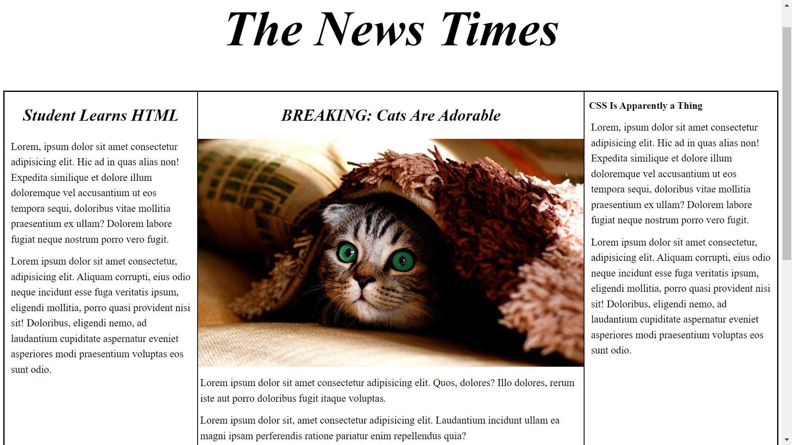
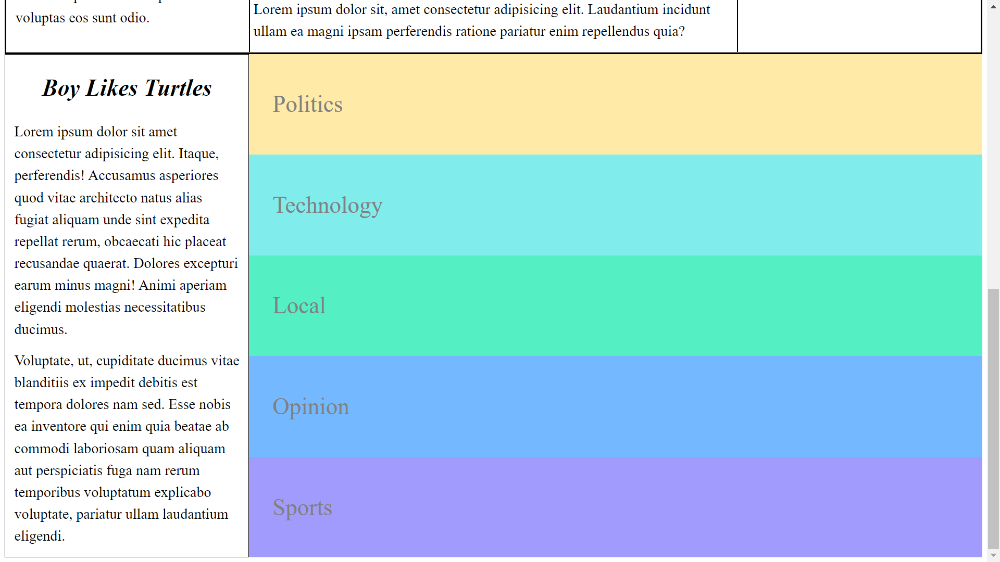

# Frontend Masters - News-Paper Project solution

This is a solution to the [News-Paper]

## Table of contents

- [Overview](#overview)
  - [The challenge](#the-challenge)
  - [Screenshot](#screenshot)
  - [Links](#links)
- [My process](#my-process)
  - [Built with](#built-with)
- [Author](#author)

## Overview

### The challenge

Users should be able to:

- Use HTML5 
- Use css and Flex-box 

### Screenshot

### Links

- Live Site URL: [Breaking news cats are adorable ](https://hlrredmoon.github.io/News-Paper/)

## My process

### Built with

- Semantic HTML5 markup
- CSS custom properties
- Flexbox

## Author
- Frontend Mentor - [@HLRRedMoon](https://www.frontendmentor.io/profile/HLRRedMoon)
- Github - [@HLRRedMoon](https://github.com/HLRRedMoon)

